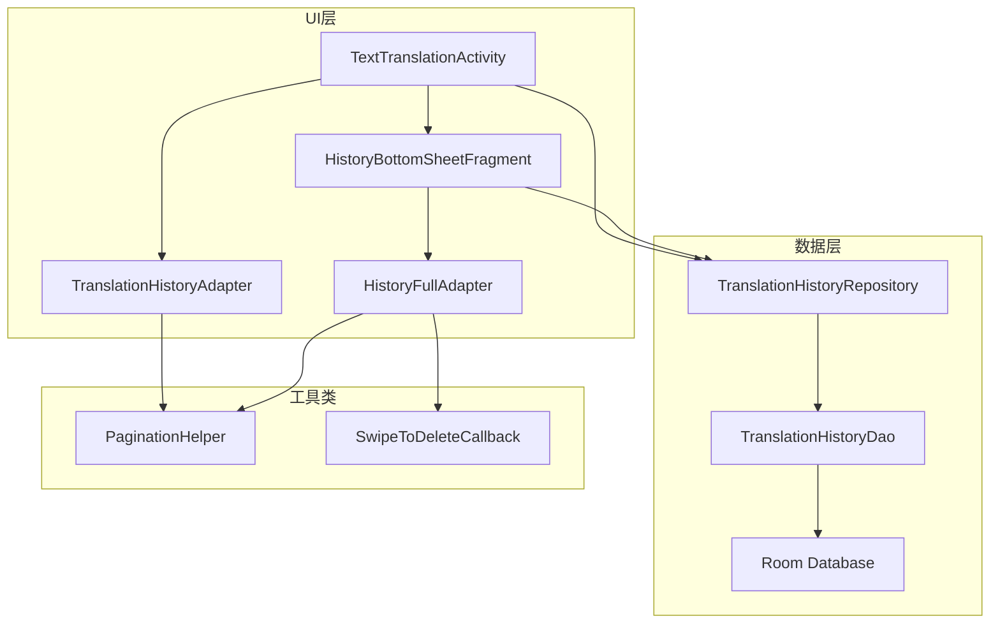
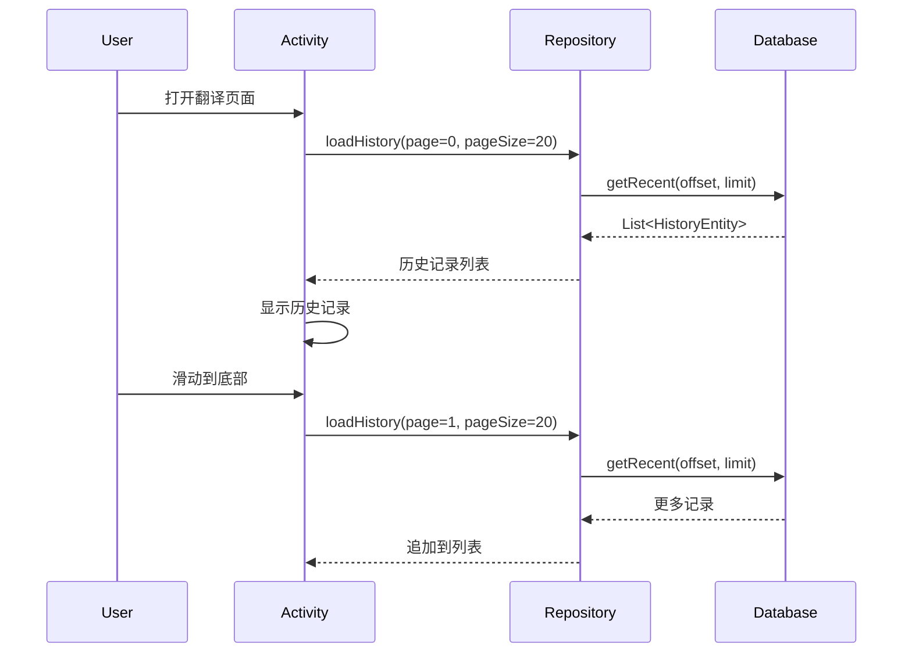

# 设计文档

## 概述

本设计文档描述翻译历史记录功能的优化方案。主要目标是解决当前实现中的滑动体验问题、存储容量限制和用户交互不便等问题。通过引入分页加载、独立历史视图、滑动删除等功能，提供更好的用户体验。

## 架构

### 整体架构



### 数据流



## 组件和接口

### 1. TranslationHistoryRepository

负责历史记录的数据管理，提供分页查询、删除、搜索等功能。

```java
public class TranslationHistoryRepository {
    private static final int MAX_HISTORY_COUNT = 500;
    private static final int PAGE_SIZE = 20;
    
    // 分页获取历史记录
    public List<TranslationHistoryEntity> getHistoryPage(int page);
    
    // 搜索历史记录
    public List<TranslationHistoryEntity> searchHistory(String keyword, int page);
    
    // 删除单条记录
    public void deleteHistory(int id);
    
    // 清理超出限制的旧记录
    public void cleanupOldRecords();
    
    // 获取总记录数
    public int getTotalCount();
    
    // 检查是否有更多数据
    public boolean hasMoreData(int currentPage);
}
```

### 2. HistoryBottomSheetFragment

独立的历史记录视图，以BottomSheet形式展示完整历史列表。

```java
public class HistoryBottomSheetFragment extends BottomSheetDialogFragment {
    // 初始化RecyclerView和分页加载
    private void setupRecyclerView();
    
    // 加载更多数据
    private void loadMoreHistory();
    
    // 搜索历史记录
    private void searchHistory(String keyword);
    
    // 删除历史记录
    private void deleteHistoryItem(int position);
    
    // 点击历史记录回调
    public interface OnHistorySelectedListener {
        void onHistorySelected(TranslationHistoryEntity history);
    }
}
```

### 3. HistoryFullAdapter

支持分页加载和滑动删除的历史记录适配器。

```java
public class HistoryFullAdapter extends RecyclerView.Adapter<RecyclerView.ViewHolder> {
    private static final int VIEW_TYPE_ITEM = 0;
    private static final int VIEW_TYPE_LOADING = 1;
    
    // 添加更多数据
    public void addItems(List<TranslationHistoryEntity> items);
    
    // 移除单条数据
    public void removeItem(int position);
    
    // 设置加载状态
    public void setLoading(boolean isLoading);
    
    // 设置是否还有更多数据
    public void setHasMoreData(boolean hasMore);
}
```

### 4. SwipeToDeleteCallback

实现左滑删除功能的ItemTouchHelper回调。

```java
public class SwipeToDeleteCallback extends ItemTouchHelper.SimpleCallback {
    // 滑动删除回调
    public interface OnSwipeDeleteListener {
        void onDelete(int position);
    }
    
    @Override
    public void onSwiped(RecyclerView.ViewHolder viewHolder, int direction);
    
    @Override
    public void onChildDraw(...); // 绘制删除背景和图标
}
```

### 5. 更新TranslationHistoryDao

添加分页查询和清理方法。

```java
@Dao
public interface TranslationHistoryDao {
    // 新增：分页查询
    @Query("SELECT * FROM translation_history ORDER BY timestamp DESC LIMIT :limit OFFSET :offset")
    List<TranslationHistoryEntity> getPage(int limit, int offset);
    
    // 新增：删除超出限制的旧记录
    @Query("DELETE FROM translation_history WHERE id NOT IN (SELECT id FROM translation_history ORDER BY timestamp DESC LIMIT :keepCount)")
    void deleteOldRecords(int keepCount);
    
    // 新增：根据ID删除
    @Query("DELETE FROM translation_history WHERE id = :id")
    void deleteById(int id);
}
```

## 数据模型

### TranslationHistoryEntity（现有，无需修改）

```java
@Entity(tableName = "translation_history")
public class TranslationHistoryEntity {
    @PrimaryKey(autoGenerate = true)
    private int id;
    private String sourceText;
    private String translatedText;
    private String sourceLanguage;
    private String targetLanguage;
    private long timestamp;
    private boolean isFavorited;
}
```

### HistoryLoadState（新增）

```java
public class HistoryLoadState {
    private boolean isLoading;
    private boolean hasMoreData;
    private int currentPage;
    private String errorMessage;
}
```

## 正确性属性

*A property is a characteristic or behavior that should hold true across all valid executions of a system-essentially, a formal statement about what the system should do. 
Properties serve as the bridge between human-readable specifications and machine-verifiable correctness guarantees.*

### Property 1: 存储容量保证

*对于任意*数量的历史记录插入操作，数据库中存储的记录数量应始终不超过500条。

**Validates: Requirements 1.1, 1.2**

### Property 2: 持久化往返一致性

*对于任意*有效的翻译历史记录，插入数据库后立即查询应返回与原始数据相同的记录内容。

**Validates: Requirements 1.3**

### Property 3: 分页加载正确性

*对于任意*包含N条记录的数据库（N > 20），分页查询第P页（每页20条）应返回正确的记录子集，且记录按时间戳降序排列。

**Validates: Requirements 3.1, 3.2**

### Property 4: 删除操作正确性

*对于任意*存在于数据库中的历史记录，执行删除操作后，该记录应不再存在于数据库中，且其他记录保持不变。

**Validates: Requirements 5.2**

### Property 5: 搜索结果正确性

*对于任意*搜索关键词和历史记录集合，搜索结果应仅包含源文本或翻译文本中包含该关键词的记录。

**Validates: Requirements 6.1, 6.2**

### Property 6: 时间格式化正确性

*对于任意*有效的时间戳，格式化函数应返回人类可读的时间字符串，且该字符串能够正确表示原始时间。

**Validates: Requirements 7.1**

## 错误处理

### 数据库错误

| 错误场景 | 处理方式 |
|---------|---------|
| 数据库查询失败 | 显示错误提示，保持当前列表状态 |
| 插入记录失败 | 显示Toast提示，不影响翻译结果显示 |
| 删除记录失败 | 显示错误提示，恢复列表项显示 |

### 分页加载错误

| 错误场景 | 处理方式 |
|---------|---------|
| 加载更多失败 | 显示重试按钮，允许用户手动重试 |
| 网络超时 | 显示超时提示，保持已加载数据 |

### UI错误

| 错误场景 | 处理方式 |
|---------|---------|
| BottomSheet显示失败 | 回退到内嵌列表显示 |
| 滑动删除动画异常 | 直接删除，不播放动画 |

## 测试策略

### 双重测试方法

本项目采用单元测试和属性测试相结合的方式，确保代码正确性。

### 单元测试

单元测试用于验证特定场景和边界条件：

1. **Repository单元测试**
   - 测试分页查询返回正确数量的记录
   - 测试空数据库查询返回空列表
   - 测试删除不存在的记录不抛出异常

2. **Adapter单元测试**
   - 测试添加数据后列表正确更新
   - 测试移除数据后列表正确更新
   - 测试加载状态正确显示

3. **时间格式化单元测试**
   - 测试今天的时间显示为"今天 HH:mm"
   - 测试昨天的时间显示为"昨天 HH:mm"
   - 测试更早的时间显示为"MM-dd HH:mm"

### 属性测试

使用JUnit 5的参数化测试和自定义生成器实现属性测试：

**测试框架**: JUnit 5 + jqwik (Java属性测试库)

**配置要求**: 每个属性测试运行最少100次迭代

**属性测试标注格式**: `**Feature: translation-history-optimization, Property {number}: {property_text}**`

1. **存储容量属性测试**
   - 生成随机数量（1-1000）的历史记录
   - 验证数据库记录数不超过500

2. **持久化往返属性测试**
   - 生成随机历史记录实体
   - 插入后查询，验证数据一致性

3. **分页加载属性测试**
   - 生成随机数量的记录
   - 验证分页查询返回正确的记录子集

4. **删除正确性属性测试**
   - 生成随机历史记录集合
   - 随机选择一条删除
   - 验证删除后该记录不存在，其他记录不变

5. **搜索正确性属性测试**
   - 生成随机历史记录集合
   - 生成随机搜索关键词
   - 验证搜索结果都包含关键词

6. **时间格式化属性测试**
   - 生成随机时间戳
   - 验证格式化结果符合预期格式

