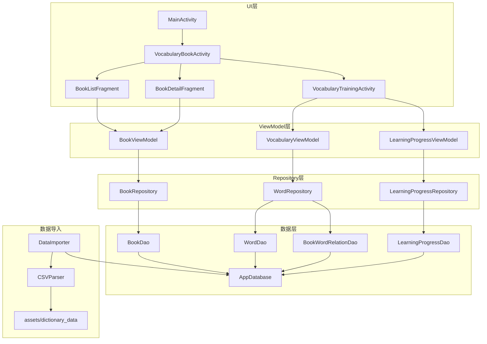
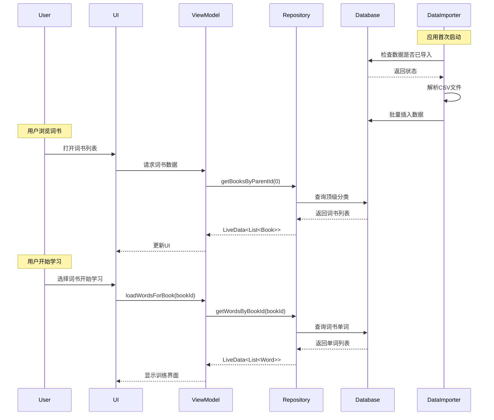
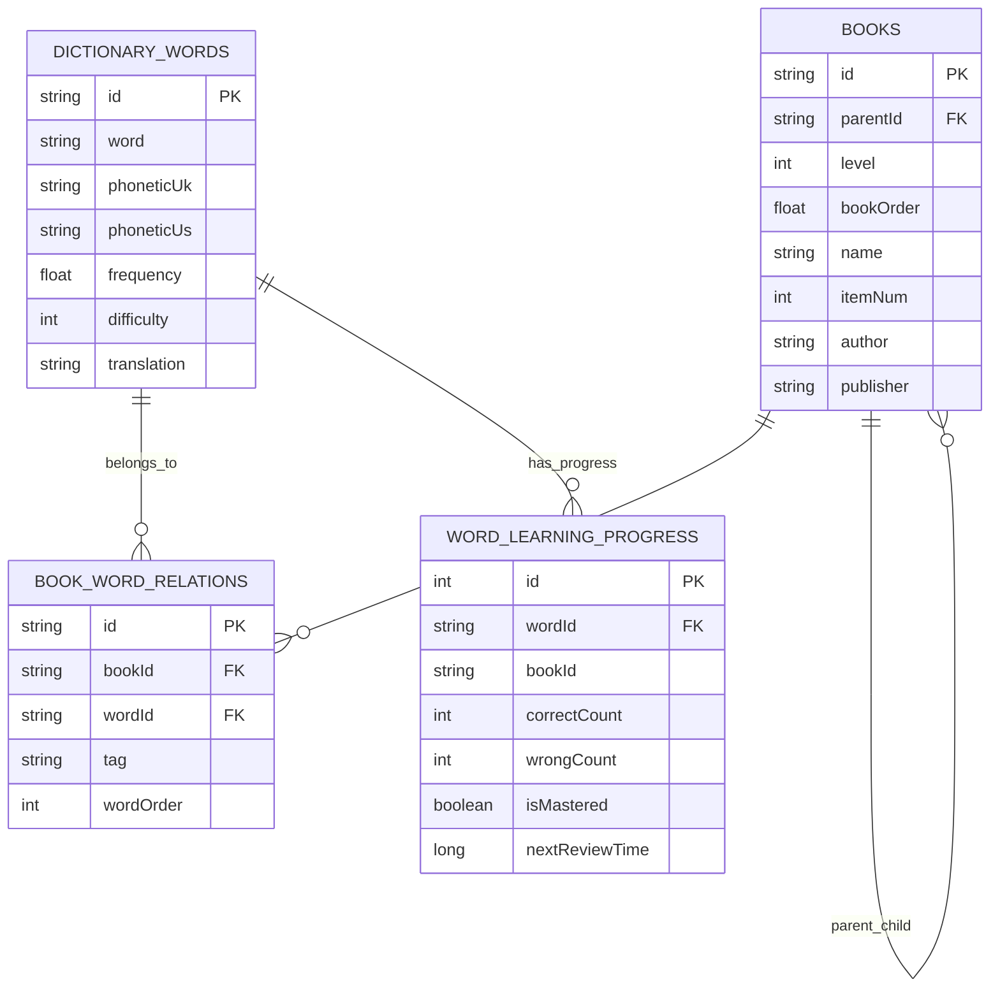

# 设计文档：词汇数据源集成与单词书功能

## 概述

本设计文档描述了将 DictionaryData 高质量英语词典数据集集成到现有词汇训练系统的技术方案。系统采用 Android Room 数据库存储词汇数据，使用 MVVM 架构模式，支持单词书浏览、词汇学习、智能复习等功能。

## 架构

### 整体架构图



### 数据流图



## 组件和接口

### 1. 数据实体类

#### DictionaryWordEntity（词典单词实体）

```java
@Entity(tableName = "dictionary_words",
    indices = {
        @Index(value = "word", unique = true),
        @Index("difficulty"),
        @Index("frequency")
    })
public class DictionaryWordEntity {
    @PrimaryKey
    private String id;              // 原始ID: 57067c89a172044907c6698e
    private String word;            // 单词: superspecies
    private String phoneticUk;      // 英式音标: [su:pərsˈpi:ʃi:z]
    private String phoneticUs;      // 美式音标: [supɚsˈpiʃiz]
    private float frequency;        // 词频: 0.0-1.0
    private int difficulty;         // 难度: 1-10
    private float acknowledgeRate;  // 认识率: 0.0-1.0
    private String translation;     // 中文翻译（从word_translation合并）
}
```

#### BookEntity（词书实体）

```java
@Entity(tableName = "books",
    indices = {
        @Index("parentId"),
        @Index("level"),
        @Index("bookOrder")
    })
public class BookEntity {
    @PrimaryKey
    private String id;              // 词书ID
    private String parentId;        // 父分类ID（0表示顶级）
    private int level;              // 等级: 1=顶级分类, 2=具体词书
    private float bookOrder;        // 排序
    private String name;            // 书名
    private int itemNum;            // 单词总数
    private int directItemNum;      // 直接单词数
    private String author;          // 作者
    private String fullName;        // 完整书名
    private String comment;         // 描述
    private String organization;    // 组织
    private String publisher;       // 出版社
    private String version;         // 版本
    private String flag;            // 标记
}
```

#### BookWordRelationEntity（词书-单词关联）

```java
@Entity(tableName = "book_word_relations",
    indices = {
        @Index("bookId"),
        @Index("wordId"),
        @Index(value = {"bookId", "wordId"}, unique = true)
    },
    foreignKeys = {
        @ForeignKey(entity = BookEntity.class, 
                    parentColumns = "id", 
                    childColumns = "bookId",
                    onDelete = ForeignKey.CASCADE),
        @ForeignKey(entity = DictionaryWordEntity.class,
                    parentColumns = "id",
                    childColumns = "wordId",
                    onDelete = ForeignKey.CASCADE)
    })
public class BookWordRelationEntity {
    @PrimaryKey
    private String id;              // 关系ID
    private String bookId;          // 词书ID
    private String wordId;          // 单词ID
    private String flag;            // 分组标记
    private String tag;             // 分组名: Unit 1
    private int wordOrder;          // 排序
}
```

#### WordLearningProgressEntity（单词学习进度）

```java
@Entity(tableName = "word_learning_progress",
    indices = {
        @Index(value = {"userId", "wordId"}, unique = true),
        @Index("nextReviewTime"),
        @Index("isMastered")
    })
public class WordLearningProgressEntity {
    @PrimaryKey(autoGenerate = true)
    private int id;
    private String userId;          // 用户ID（预留多用户）
    private String wordId;          // 单词ID
    private String bookId;          // 所属词书ID
    private int correctCount;       // 正确次数
    private int wrongCount;         // 错误次数
    private boolean isMastered;     // 是否掌握
    private int memoryStrength;     // 记忆强度: 1-10
    private long lastStudyTime;     // 最后学习时间
    private long nextReviewTime;    // 下次复习时间
    private int reviewCount;        // 复习次数
    private long createdTime;       // 创建时间
}
```

### 2. DAO接口

#### BookDao

```java
@Dao
public interface BookDao {
    @Query("SELECT * FROM books WHERE parentId = :parentId ORDER BY bookOrder")
    LiveData<List<BookEntity>> getBooksByParentId(String parentId);
    
    @Query("SELECT * FROM books WHERE level = 1 ORDER BY bookOrder")
    LiveData<List<BookEntity>> getTopLevelBooks();
    
    @Query("SELECT * FROM books WHERE id = :bookId")
    LiveData<BookEntity> getBookById(String bookId);
    
    @Query("SELECT * FROM books WHERE name LIKE '%' || :keyword || '%'")
    LiveData<List<BookEntity>> searchBooks(String keyword);
    
    @Insert(onConflict = OnConflictStrategy.REPLACE)
    void insertBooks(List<BookEntity> books);
    
    @Query("SELECT COUNT(*) FROM books")
    int getBookCount();
}
```

#### DictionaryWordDao

```java
@Dao
public interface DictionaryWordDao {
    @Query("SELECT dw.* FROM dictionary_words dw " +
           "INNER JOIN book_word_relations bwr ON dw.id = bwr.wordId " +
           "WHERE bwr.bookId = :bookId ORDER BY bwr.wordOrder")
    LiveData<List<DictionaryWordEntity>> getWordsByBookId(String bookId);
    
    @Query("SELECT * FROM dictionary_words WHERE word = :word")
    DictionaryWordEntity getWordByWord(String word);
    
    @Query("SELECT * FROM dictionary_words WHERE word LIKE :keyword || '%' LIMIT 50")
    LiveData<List<DictionaryWordEntity>> searchWords(String keyword);
    
    @Query("SELECT * FROM dictionary_words ORDER BY RANDOM() LIMIT :limit")
    List<DictionaryWordEntity> getRandomWords(int limit);
    
    @Insert(onConflict = OnConflictStrategy.REPLACE)
    void insertWords(List<DictionaryWordEntity> words);
    
    @Query("SELECT COUNT(*) FROM dictionary_words")
    int getWordCount();
}
```

### 3. 数据导入器

```java
public class DictionaryDataImporter {
    private static final String PREF_DATA_IMPORTED = "dictionary_data_imported";
    private static final int BATCH_SIZE = 1000;
    
    public interface ImportProgressListener {
        void onProgress(int current, int total, String message);
        void onComplete(boolean success, String message);
    }
    
    public void importDataAsync(Context context, ImportProgressListener listener);
    
    private List<DictionaryWordEntity> parseWordCsv(InputStream is);
    private Map<String, String> parseTranslationCsv(InputStream is);
    private List<BookEntity> parseBookCsv(InputStream is);
    private List<BookWordRelationEntity> parseRelationCsv(InputStream is);
}
```

### 4. Repository层

```java
public class BookRepository {
    private BookDao bookDao;
    private DictionaryWordDao wordDao;
    private BookWordRelationDao relationDao;
    
    public LiveData<List<BookEntity>> getTopLevelBooks();
    public LiveData<List<BookEntity>> getChildBooks(String parentId);
    public LiveData<BookEntity> getBookDetail(String bookId);
    public LiveData<List<DictionaryWordEntity>> getWordsForBook(String bookId);
    public LiveData<BookLearningProgress> getBookProgress(String bookId);
}
```

## 数据模型

### 数据库ER图



### CSV文件格式说明

| 文件 | 分隔符 | 字段数 | 预估行数 |
|------|--------|--------|----------|
| word.csv | `>` | 7 | ~70,000 |
| word_translation.csv | `,` | 2 | ~100,000 |
| book.csv | `>` | 14 | ~600 |
| relation_book_word.zip | `>` | 6 | ~500,000 |


## 正确性属性

*正确性属性是系统应该在所有有效执行中保持为真的特征或行为。属性作为人类可读规范和机器可验证正确性保证之间的桥梁。*

### Property 1: CSV解析往返一致性

*对于任意*有效的CSV行数据，解析后再序列化回CSV格式，应该产生等价的数据（忽略空白字符差异）。

**验证: 需求 1.3, 1.4, 1.5, 1.6**

### Property 2: 数据导入幂等性

*对于任意*词典数据集，多次执行导入操作后，数据库中的记录数应该与单次导入相同，不会产生重复数据。

**验证: 需求 1.9**

### Property 3: 词书层级查询一致性

*对于任意*词书查询，返回的子词书列表中所有词书的parentId应该等于查询的父词书ID。

**验证: 需求 2.6, 3.2**

### Property 4: 单词筛选结果一致性

*对于任意*单词筛选条件（难度、词频范围），返回的所有单词都应该满足指定的筛选条件。

**验证: 需求 2.5**

### Property 5: 词书搜索结果相关性

*对于任意*搜索关键词，返回的词书列表中每本词书的名称都应该包含该关键词（不区分大小写）。

**验证: 需求 3.5**

### Property 6: 学习进度统计一致性

*对于任意*词书，已学习单词数 + 未学习单词数 = 词书总单词数，且学习完成百分比 = 已学习单词数 / 总单词数 * 100。

**验证: 需求 5.1, 5.2, 5.3**

### Property 7: 词书单词归属一致性

*对于任意*词书加载的单词列表，每个单词都应该存在于该词书的单词关联表中。

**验证: 需求 4.1**

### Property 8: 艾宾浩斯复习间隔一致性

*对于任意*单词学习记录，答对后的下次复习间隔应该大于答对前的间隔，答错后的下次复习间隔应该小于或等于答错前的间隔。

**验证: 需求 6.1, 6.4, 6.5**

### Property 9: 复习队列筛选一致性

*对于任意*时间点的复习队列查询，返回的所有单词的nextReviewTime都应该小于或等于当前时间。

**验证: 需求 6.2, 6.3**

### Property 10: 训练模式题目生成一致性

*对于任意*训练模式和单词，生成的题目选项中应该包含且仅包含一个正确答案，且正确答案与单词的实际释义/拼写匹配。

**验证: 需求 8.1, 8.2, 8.3, 8.4, 8.5**

### Property 11: 数据导出导入往返一致性

*对于任意*学习进度数据，导出为JSON后再导入，应该恢复出与原始数据等价的学习进度记录。

**验证: 需求 9.2, 9.3**

### Property 12: 分页加载数量限制

*对于任意*分页查询请求，返回的数据条数应该小于或等于指定的页大小（默认50条）。

**验证: 需求 10.1**

## 错误处理

### 数据导入错误

| 错误类型 | 处理策略 | 用户提示 |
|---------|---------|---------|
| CSV文件不存在 | 记录日志，跳过该文件 | 无（静默处理） |
| CSV格式错误 | 跳过错误行，继续处理 | 无（静默处理） |
| 数据库写入失败 | 回滚当前批次，重试3次 | "数据初始化失败，请重启应用" |
| 内存不足 | 减小批量大小，分批处理 | "正在处理大量数据，请稍候" |

### 学习功能错误

| 错误类型 | 处理策略 | 用户提示 |
|---------|---------|---------|
| 词书无单词 | 显示空状态页面 | "该词书暂无单词数据" |
| 发音加载失败 | 显示错误图标 | "发音加载失败，请检查网络" |
| 进度保存失败 | 本地缓存，稍后重试 | "进度保存失败，将自动重试" |

## 测试策略

### 单元测试

- CSV解析器测试：验证各种格式的CSV数据解析正确性
- 实体转换测试：验证数据库实体与业务对象的转换
- 进度计算测试：验证学习进度百分比计算
- 复习间隔测试：验证艾宾浩斯曲线计算

### 属性测试

使用 JUnit + jqwik 进行属性测试：

- **Property 1-2**: CSV解析和数据导入测试
- **Property 3-5**: 查询和搜索功能测试
- **Property 6-7**: 学习进度统计测试
- **Property 8-9**: 复习系统测试
- **Property 10**: 训练模式测试
- **Property 11-12**: 数据导出和分页测试

### 集成测试

- 数据库操作测试：使用 Room 的 in-memory 数据库
- Repository 层测试：验证数据流完整性
- ViewModel 测试：验证 LiveData 更新

### UI测试

- 词书列表导航测试
- 学习流程端到端测试
- 进度显示正确性测试
