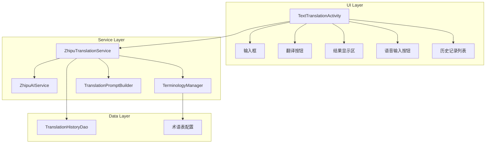

# Design Document: 智谱AI输入翻译模块

## Overview

本设计将 `TextTranslationActivity` 从 Google ML Kit 离线翻译改造为调用智谱AI在线翻译。核心改动包括：
1. 移除 ML Kit 翻译器依赖
2. 复用现有的 `ZhipuAIService` 进行翻译
3. 新增术语约束翻译功能，通过 Prompt 工程实现专业术语的精确翻译
4. 保留现有的语音输入、历史记录等功能

## Architecture



## Components and Interfaces

### 1. ZhipuTranslationService (新增)

专门用于翻译的服务类，封装翻译逻辑。

```java
public class ZhipuTranslationService {
    private ZhipuAIService aiService;
    private TerminologyManager terminologyManager;
    
    // 执行翻译
    public void translate(String text, String sourceLang, String targetLang, 
                         TranslationCallback callback);
    
    // 翻译回调接口
    public interface TranslationCallback {
        void onSuccess(String translatedText);
        void onError(String error);
    }
}
```

### 2. TerminologyManager (新增)

管理专业术语映射表。

```java
public class TerminologyManager {
    // 获取英译中术语表
    public Map<String, String> getEnToZhTerms();
    
    // 获取中译英术语表
    public Map<String, String> getZhToEnTerms();
    
    // 根据翻译方向获取术语表
    public Map<String, String> getTermsForDirection(String sourceLang, String targetLang);
    
    // 格式化术语表为Prompt文本
    public String formatTermsForPrompt(String sourceLang, String targetLang);
}
```

### 3. TranslationPromptBuilder (新增)

构建翻译Prompt。

```java
public class TranslationPromptBuilder {
    // 构建翻译Prompt
    public String buildPrompt(String text, String sourceLang, String targetLang, 
                             String terminologyText);
    
    // 解析AI响应，提取翻译结果
    public String parseTranslationResponse(String response);
}
```

### 4. TextTranslationActivity (修改)

移除 ML Kit 相关代码，改用 `ZhipuTranslationService`。

主要修改：
- 移除 `Translator` 成员变量和相关导入
- 移除 `downloadTranslationModel()` 方法
- 修改 `performTranslation()` 方法调用新服务
- 修改 `initTranslator()` 为 `initTranslationService()`

## Data Models

### 术语表数据结构

术语表以硬编码方式存储在 `TerminologyManager` 中：

```java
// 英译中术语表示例
private static final Map<String, String> EN_TO_ZH_TERMS = new HashMap<String, String>() {{
    put("machine learning", "机器学习");
    put("artificial intelligence", "人工智能");
    put("deep learning", "深度学习");
    put("neural network", "神经网络");
    put("natural language processing", "自然语言处理");
    // ... 更多术语
}};

// 中译英术语表示例
private static final Map<String, String> ZH_TO_EN_TERMS = new HashMap<String, String>() {{
    put("机器学习", "machine learning");
    put("人工智能", "artificial intelligence");
    // ... 更多术语
}};
```

### 翻译Prompt模板

```
你是一个专业的翻译助手。请将以下{源语言}文本翻译成{目标语言}。

【术语约束】
翻译时请严格遵循以下术语对照表：
{术语表}

【翻译要求】
1. 保持原文的语义和语气
2. 术语表中的词汇必须按照指定方式翻译
3. 只输出翻译结果，不要添加任何解释或说明

【待翻译文本】
{用户输入文本}

【翻译结果】
```

## Correctness Properties

*A property is a characteristic or behavior that should hold true across all valid executions of a system-essentially, a formal statement about what the system should do. Properties serve as the bridge between human-readable specifications and machine-verifiable correctness guarantees.*

### Property 1: Prompt contains all terminology mappings
*For any* terminology list and translation direction, the constructed prompt SHALL contain all term mappings from the terminology list in the correct format.
**Validates: Requirements 2.1, 2.3, 2.4, 6.1**

### Property 2: Language switch is symmetric
*For any* source and target language pair, switching languages SHALL result in the source becoming the target and vice versa.
**Validates: Requirements 3.1**

### Property 3: History persistence round-trip
*For any* completed translation, saving to history and then retrieving SHALL return the same source text, translated text, and language direction.
**Validates: Requirements 4.1**

### Property 4: History ordering by timestamp
*For any* set of translation history items, retrieving them SHALL return items ordered by timestamp in descending order (most recent first).
**Validates: Requirements 4.2**

### Property 5: Response parsing extracts translation
*For any* valid AI response containing a translation, the parser SHALL extract only the translated text without additional content.
**Validates: Requirements 6.3**

## Error Handling

| 错误场景 | 处理方式 |
|---------|---------|
| 网络不可用 | 显示"网络连接失败，请检查网络设置"提示 |
| API调用超时 | 显示"翻译请求超时，请重试"提示 |
| API返回错误 | 显示具体错误信息 |
| 输入为空 | 显示"请输入要翻译的内容"提示 |
| API Key无效 | 显示"API配置错误，请联系开发者"提示 |

## Testing Strategy

### 单元测试

1. **TerminologyManager测试**
   - 测试术语表加载
   - 测试根据翻译方向获取正确的术语表
   - 测试术语格式化输出

2. **TranslationPromptBuilder测试**
   - 测试Prompt构建包含所有必要元素
   - 测试响应解析提取正确内容

3. **ZhipuTranslationService测试**
   - 测试翻译请求构建
   - 测试回调正确触发

### 属性测试

使用 JUnit 5 + jqwik 进行属性测试：

1. **Property 1**: 验证任意术语表都能正确嵌入Prompt
2. **Property 2**: 验证语言切换的对称性
3. **Property 3**: 验证历史记录的持久化往返一致性
4. **Property 4**: 验证历史记录的时间排序
5. **Property 5**: 验证响应解析的正确性

每个属性测试配置运行至少100次迭代。

测试标注格式：`**Feature: zhipu-translation, Property {number}: {property_text}**`
