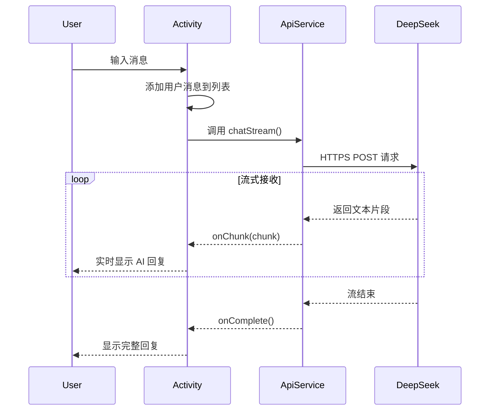

# DeepSeek AI 接入文档

## 📚 目录

- [1. 简介](#1-简介)
- [2. 功能特性](#2-功能特性)
- [3. 快速开始](#3-快速开始)
- [4. API 配置](#4-api-配置)
- [5. 使用说明](#5-使用说明)
- [6. 技术实现](#6-技术实现)
- [7. 常见问题](#7-常见问题)
- [8. 进阶使用](#8-进阶使用)

---

## 1. 简介

DeepSeek AI 是一个强大的大语言模型，已成功接入到你的英语学习助手应用中。通过 DeepSeek，学生可以获得智能化的英语学习辅导，包括翻译、语法纠错、作文批改、学习建议等功能。

### 1.1 为什么选择 DeepSeek？

- 💡 **性能优秀** - 在多项基准测试中表现出色
- 💰 **价格实惠** - 相比其他大模型，价格更具竞争力
- 🚀 **响应迅速** - 低延迟，支持流式输出
- 🌏 **中文友好** - 对中英文双语支持良好
- 📖 **文档完善** - 官方文档清晰，易于集成

### 1.2 应用场景

在英语学习助手中，DeepSeek AI 可以用于：

- 📝 **英文翻译** - 中英互译，理解上下文
- ✏️ **语法纠错** - 识别并修正语法错误
- 📄 **作文批改** - 提供详细的写作建议
- 📚 **词汇解释** - 解释单词用法和搭配
- 💬 **对话练习** - 模拟英语对话场景
- 🎯 **学习建议** - 根据学生情况给出个性化建议

---

## 2. 功能特性

### 2.1 核心功能

✅ **智能对话**
- 支持多轮对话
- 保留对话历史（最近10条）
- 流式输出，实时显示回复

✅ **英语学习助手**
- 专门的系统提示，定位为英语学习辅导
- 理解学习场景，提供针对性建议
- 友好的交互方式

✅ **API 管理**
- 本地保存 API Key
- 支持动态配置
- 安全的密钥存储

### 2.2 技术特性

- 🔄 **异步处理** - 所有 API 调用在后台线程执行
- 📱 **UI 友好** - 主线程更新 UI，避免卡顿
- 💾 **本地存储** - SharedPreferences 保存配置
- 🔐 **安全通信** - HTTPS 加密传输
- ⚡ **流式输出** - Server-Sent Events (SSE) 实时显示

---

## 3. 快速开始

### 3.1 获取 API Key

1. 访问 DeepSeek 官网：https://platform.deepseek.com
2. 注册账号并登录
3. 进入 API 管理页面
4. 创建新的 API Key
5. 复制并保存 API Key

### 3.2 配置应用

1. 打开应用，进入"更多功能"页面
2. 点击"AI 学习助手"
3. 首次使用会提示配置 API Key
4. 粘贴你的 API Key 并保存
5. 开始与 AI 助手对话

### 3.3 快速测试

配置完成后，可以尝试以下测试对话：

```
用户: 你好，请帮我翻译：How are you doing today?
AI: 你好！这句话的意思是"你今天过得怎么样？"...

用户: 请帮我检查这句话的语法：He go to school every day.
AI: 这句话有一个语法错误。正确的应该是...

用户: 如何提高英语口语？
AI: 提高英语口语可以从以下几个方面入手...
```

---

## 4. API 配置

### 4.1 API Key 管理

应用使用 `SharedPreferences` 存储 API Key：

```java
// 保存 API Key
private void saveApiKey(String apiKey) {
    SharedPreferences prefs = getSharedPreferences("deepseek_config", Context.MODE_PRIVATE);
    prefs.edit().putString("api_key", apiKey).apply();
}

// 获取 API Key
private String getApiKey() {
    SharedPreferences prefs = getSharedPreferences("deepseek_config", Context.MODE_PRIVATE);
    return prefs.getString("api_key", "");
}
```

### 4.2 API 端点

- **基础 URL**: `https://api.deepseek.com`
- **聊天端点**: `/v1/chat/completions`
- **完整地址**: `https://api.deepseek.com/v1/chat/completions`

### 4.3 支持的模型

- `deepseek-chat` - 默认聊天模型（推荐）
- `deepseek-coder` - 代码专用模型

### 4.4 定价说明

DeepSeek API 按 Token 数量计费：

| 项目 | 价格 |
|------|------|
| 输入 Token | ¥0.001 / 1K tokens |
| 输出 Token | ¥0.002 / 1K tokens |

**示例计算：**
- 一次普通对话（约 200 输入 + 300 输出）
- 费用 ≈ (200 × 0.001 + 300 × 0.002) / 1000 = ¥0.0008
- 非常经济实惠！

---

## 5. 使用说明

### 5.1 基本对话

**功能说明：** 与 AI 助手进行自然语言对话

**使用步骤：**
1. 在输入框输入问题或请求
2. 点击发送按钮
3. 等待 AI 回复（支持流式显示）
4. 查看回复内容

**示例场景：**
```
场景1: 单词查询
用户: "apple" 这个单词有哪些常见用法？
AI: "apple" 这个单词作为名词，主要有以下几种用法...

场景2: 翻译请求
用户: 请把这段话翻译成英文：今天天气真好。
AI: 这句话可以翻译为：The weather is really nice today...

场景3: 语法问题
用户: 什么时候用 have done，什么时候用 had done？
AI: 这涉及到现在完成时和过去完成时的区别...
```

### 5.2 翻译功能

**功能说明：** 中英文互译，理解上下文

**使用方式：**
```
直接提问：
- "请翻译：Hello, world!"
- "这句话用英文怎么说：你好吗？"
- "帮我翻译这段文字：..."

AI 会自动识别语言方向并进行翻译
```

**高级用法：**
```
带场景的翻译：
- "在商务邮件中，'尽快回复'应该怎么说？"
- "口语化的'不客气'有哪些说法？"
- "正式场合和非正式场合如何表达'谢谢'？"
```

### 5.3 语法纠错

**功能说明：** 识别并修正语法错误

**使用方式：**
```
用户: 请检查这句话的语法：She don't like apples.
AI: 这句话有一个语法错误。正确的应该是：
"She doesn't like apples."

解释：在第三人称单数（she, he, it）的情况下，
否定句应该使用 "doesn't" 而不是 "don't"。
```

### 5.4 作文批改

**功能说明：** 提供详细的写作建议

**使用方式：**
```
用户: 请帮我批改这篇作文：
My name is Tom. I am student. I like play basketball.
Yesterday I go to park with my friend.

AI: 我来帮你批改这篇作文，指出问题并给出建议：

1. "I am student" 缺少冠词
   应改为：I am a student.
   
2. "I like play basketball" 动词形式错误
   应改为：I like playing basketball. 或 I like to play basketball.
   
3. "Yesterday I go to park" 时态错误且缺少冠词
   应改为：Yesterday I went to the park.

修改后的完整版本：
My name is Tom. I am a student. I like playing basketball.
Yesterday I went to the park with my friend.
```

### 5.5 学习建议

**功能说明：** 获取个性化学习建议

**使用方式：**
```
用户: 我的英语阅读理解总是做不好，有什么提升方法吗？

AI: 提高英语阅读理解能力可以从以下几个方面入手：

1. 扩大词汇量
   - 每天背诵30-50个新单词
   - 注重词汇的实际应用和搭配
   
2. 培养阅读习惯
   - 每天阅读英文文章15-30分钟
   - 从简单的新闻、故事开始
   
3. 提升阅读技巧
   - 学会略读(skimming)和寻读(scanning)
   - 注意文章结构和逻辑关系
   
4. 练习真题
   - 定期做阅读理解练习
   - 分析错题，总结经验

建议制定一个每日学习计划，持之以恒。
```

---

## 6. 技术实现

### 6.1 架构设计

```
DeepSeekChatActivity (UI层)
    ↓
DeepSeekApiService (API服务层)
    ↓
HTTP Client (网络层)
    ↓
DeepSeek API (远程服务)
```

### 6.2 核心类说明

#### 6.2.1 DeepSeekApiService

**职责：** API 调用和数据处理

**主要方法：**

```java
// 普通聊天（非流式）
public void chat(List<ChatMessage> messages, ChatCallback callback)

// 流式聊天（推荐）
public void chatStream(List<ChatMessage> messages, StreamCallback callback)

// 设置 API Key
public void setApiKey(String apiKey)

// 关闭服务
public void shutdown()
```

**使用示例：**

```java
// 创建服务实例
DeepSeekApiService apiService = new DeepSeekApiService("your-api-key");

// 构建消息列表
List<DeepSeekApiService.ChatMessage> messages = new ArrayList<>();
messages.add(new DeepSeekApiService.ChatMessage("system", "你是英语学习助手"));
messages.add(new DeepSeekApiService.ChatMessage("user", "请翻译：Hello"));

// 发送请求（流式）
apiService.chatStream(messages, new DeepSeekApiService.StreamCallback() {
    @Override
    public void onChunk(String chunk) {
        // 接收到一小段文本
        System.out.print(chunk);
    }
    
    @Override
    public void onComplete() {
        // 接收完成
        System.out.println("\n完成");
    }
    
    @Override
    public void onError(String error) {
        // 发生错误
        System.err.println("错误: " + error);
    }
});
```

#### 6.2.2 DeepSeekChatActivity

**职责：** 聊天界面和用户交互

**主要功能：**
- 显示聊天消息列表
- 处理用户输入
- 调用 API 服务
- 更新 UI 显示

#### 6.2.3 ChatMessage 模型

**职责：** 表示单条聊天消息

```java
public class ChatMessage {
    public static final int TYPE_SENT = 0;      // 用户发送
    public static final int TYPE_RECEIVED = 1;  // AI 回复
    
    private int type;
    private String content;
    private long timestamp;
}
```

### 6.3 数据流程



### 6.4 线程管理

**原则：** 网络操作在后台线程，UI 更新在主线程

```java
// 后台线程执行 API 调用
executorService.execute(() -> {
    // 网络请求
    String response = sendRequest(...);
    
    // 切换到主线程更新 UI
    mainHandler.post(() -> {
        updateUI(response);
    });
});
```

### 6.5 错误处理

应用实现了完善的错误处理机制：

1. **网络错误**
   - 超时处理（连接超时 30s，读取超时 30s）
   - HTTP 错误码识别
   - 错误信息友好提示

2. **API 错误**
   - API Key 无效
   - 配额超限
   - 请求格式错误

3. **应用错误**
   - JSON 解析错误
   - 空指针保护
   - 异常捕获和日志记录

---

## 7. 常见问题

### 7.1 API Key 相关

**Q1: 如何获取 API Key？**

A: 访问 https://platform.deepseek.com 注册账号，在控制台创建 API Key。

**Q2: API Key 保存在哪里？**

A: 保存在应用的 SharedPreferences 中，路径：`/data/data/com.example.mybighomework/shared_prefs/deepseek_config.xml`

**Q3: API Key 安全吗？**

A: SharedPreferences 是应用私有存储，其他应用无法访问。但建议：
- 不要分享你的 API Key
- 定期更换 API Key
- 监控 API 使用情况

### 7.2 使用问题

**Q4: 为什么 AI 不回复？**

可能原因：
1. API Key 未配置或无效
2. 网络连接问题
3. API 配额用完
4. 服务器繁忙

解决方法：
- 检查 API Key 是否正确
- 确认网络连接正常
- 查看错误提示信息
- 检查 DeepSeek 控制台的使用情况

**Q5: 回复速度慢怎么办？**

可能原因：
- 网络延迟
- 模型处理复杂请求
- 服务器负载高

优化建议：
- 使用流式输出（已默认启用）
- 简化提问方式
- 避免过长的上下文

**Q6: 如何获得更好的回复质量？**

提示技巧：
- 清晰明确地表达需求
- 提供足够的上下文
- 使用具体的例子
- 分步骤提问

### 7.3 技术问题

**Q7: 应用崩溃怎么办？**

检查步骤：
1. 查看 Logcat 日志
2. 确认网络权限已添加
3. 检查是否在主线程调用网络
4. 验证 JSON 解析是否正确

**Q8: 如何调试 API 调用？**

```java
// 在 DeepSeekApiService 中启用详细日志
private static final String TAG = "DeepSeekApiService";
Log.d(TAG, "Request: " + requestBody);
Log.d(TAG, "Response: " + response);
```

**Q9: 如何处理网络超时？**

应用已设置默认超时：
```java
connection.setConnectTimeout(30000);  // 连接超时 30s
connection.setReadTimeout(30000);     // 读取超时 30s
```

可以根据需要调整这些值。

---

## 8. 进阶使用

### 8.1 自定义系统提示

修改 `DeepSeekChatActivity.java` 中的系统提示：

```java
private List<DeepSeekApiService.ChatMessage> buildApiMessages() {
    List<DeepSeekApiService.ChatMessage> apiMessages = new ArrayList<>();
    
    // 自定义系统提示
    String systemPrompt = "你是一个专业的英语学习助手，" +
        "擅长帮助准备考研的学生提高英语水平。" +
        "你的回答应该：" +
        "1. 简洁明了，重点突出" +
        "2. 提供具体的例子" +
        "3. 给出实用的建议" +
        "4. 使用友好的语气";
    
    apiMessages.add(new DeepSeekApiService.ChatMessage("system", systemPrompt));
    
    // ... 其他消息
}
```

### 8.2 调整对话历史长度

```java
// 默认保留最近 10 条消息
int startIndex = Math.max(0, messageList.size() - 10);

// 可以修改为其他值，例如 20 条
int startIndex = Math.max(0, messageList.size() - 20);
```

### 8.3 添加更多模型参数

在 `DeepSeekApiService.java` 中添加更多参数：

```java
private JSONObject buildRequestBody(List<ChatMessage> messages, String model) 
        throws JSONException {
    JSONObject requestBody = new JSONObject();
    requestBody.put("model", model);
    requestBody.put("messages", messagesArray);
    
    // 添加更多参数
    requestBody.put("temperature", 0.7);      // 控制随机性 (0-2)
    requestBody.put("max_tokens", 2000);      // 最大输出长度
    requestBody.put("top_p", 0.9);            // 核采样参数
    requestBody.put("frequency_penalty", 0);  // 频率惩罚 (-2 到 2)
    requestBody.put("presence_penalty", 0);   // 存在惩罚 (-2 到 2)
    
    return requestBody;
}
```

### 8.4 保存对话历史到数据库

创建 `ChatHistoryEntity` 和 `ChatHistoryDao`：

```java
@Entity(tableName = "chat_history")
public class ChatHistoryEntity {
    @PrimaryKey(autoGenerate = true)
    private int id;
    
    private int messageType;      // 0=用户, 1=AI
    private String content;
    private long timestamp;
    private String conversationId; // 对话会话 ID
}
```

### 8.5 实现语音输入

结合已有的语音识别功能：

```java
// 在 DeepSeekChatActivity 中添加语音按钮
btnVoice.setOnClickListener(v -> {
    // 调用 SparkChain 语音识别
    startVoiceRecognition();
});

private void startVoiceRecognition() {
    // 语音识别完成后，将识别结果填入输入框
    // 然后自动发送
}
```

### 8.6 添加快捷功能

在聊天界面添加快捷按钮：

```java
// 快捷翻译
btnQuickTranslate.setOnClickListener(v -> {
    etInput.setText("请翻译：");
    etInput.setSelection(etInput.getText().length());
});

// 快捷语法检查
btnQuickGrammar.setOnClickListener(v -> {
    etInput.setText("请检查语法：");
    etInput.setSelection(etInput.getText().length());
});

// 快捷作文批改
btnQuickEssay.setOnClickListener(v -> {
    etInput.setText("请批改作文：");
    etInput.setSelection(etInput.getText().length());
});
```

---

## 9. 最佳实践

### 9.1 API 使用建议

1. **合理控制对话长度**
   - 保留必要的上下文（推荐 5-10 条）
   - 过长的历史会增加 Token 消耗

2. **使用流式输出**
   - 提供更好的用户体验
   - 实时显示回复内容

3. **实现请求限流**
   - 避免频繁请求
   - 可以添加冷却时间（例如 2 秒）

4. **监控使用情况**
   - 定期检查 API 使用量
   - 设置预算警告

### 9.2 用户体验优化

1. **加载状态**
   - 显示"AI 正在思考..."
   - 禁用发送按钮防止重复提交

2. **错误提示**
   - 友好的错误信息
   - 提供解决建议

3. **快速响应**
   - 立即显示用户消息
   - 流式显示 AI 回复

4. **离线处理**
   - 检查网络状态
   - 提示用户连接网络

### 9.3 安全建议

1. **API Key 保护**
   - 不在代码中硬编码
   - 使用 ProGuard 混淆
   - 考虑使用后端代理

2. **输入验证**
   - 限制输入长度
   - 过滤敏感内容
   - 防止注入攻击

3. **错误处理**
   - 捕获所有异常
   - 记录错误日志
   - 不泄露敏感信息

---

## 10. 总结

通过本文档，你已经了解了如何在英语学习助手应用中使用 DeepSeek AI。主要内容包括：

✅ **功能介绍** - 了解 DeepSeek 的能力和应用场景
✅ **快速开始** - 获取 API Key 并配置应用
✅ **使用说明** - 学习各种功能的使用方法
✅ **技术实现** - 理解代码架构和实现细节
✅ **常见问题** - 解决使用中遇到的问题
✅ **进阶使用** - 自定义和扩展功能

### 下一步

1. 获取 DeepSeek API Key
2. 在应用中配置 API Key
3. 开始与 AI 助手对话
4. 探索更多功能和使用场景

### 相关资源

- **DeepSeek 官网**: https://www.deepseek.com
- **API 文档**: https://platform.deepseek.com/docs
- **价格说明**: https://platform.deepseek.com/pricing
- **社区支持**: https://github.com/deepseek-ai

---

**祝你使用愉快！** 🎉

如有问题或建议，欢迎反馈。

